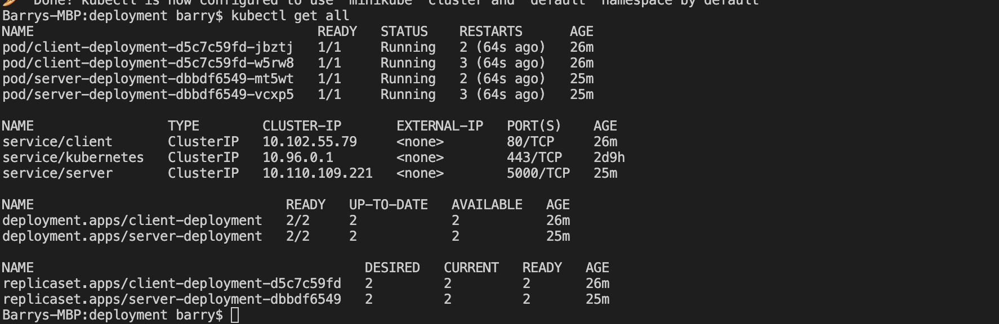
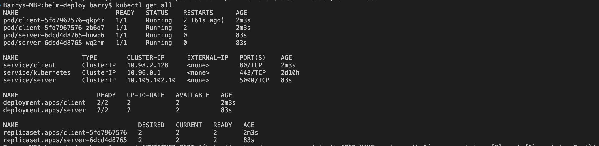

# Simple microservice application
  + This application contains the frontend (client) and the backend (server) microservices built with javascript 
    + node.js and express.js on the server side
    + React framework on the client side
  + The client (frontend) service basically fetch the word **TALENT PLUS** from the backend service using an Application Programming Interface (API) call to the backend service to fetch data.

##  Flow of execution
  + You start up the backend service by changing directory into the server directory and run

        npm run dev
  + You can access the server (backend) service by accessing it on port 5000 on the browser by running 

        http://localhost:5000
  + Open another terminal to run the client side service because it is dependent on the backend service through the API call.
  + Do this by changing the directory to client directory and run:

        npm start
  + We can access our client service on the browser by entering:

        http://localhost:3000
  + That will then fetch the word **"TALENT PLUS"** from the server service through API.

## Dockerizartion of both the Frontend and Backend application
  + The Client's Dockerfile [here](./client/Dockerfile) and the Server's Dockerfile [here](./server/Dockerfile) was built.
  + Both the Client and the server dockerfile were built simultaneously using the docker-compose file [here](./docker-compose.yml) by typing the command

        docker-compose up -d

  + Now we have succesfully built the Client and the Server images, we can view this by running 

        docker images
      + Hence, we have two images built

            simple_microservice_app_client
            simple_microservice_app_server
  + We can then run both the images on thesame network for them to communicate with each other. Also note that after creating the images, we automatically generate a network called ''simple_microservice_app_default'' which act as a bridge network
    + client's container
          
          docker run -d --net simple_microservice_app_default -p3000:3000 --name client simple_microservice_app_client
    + Server's container

          docker run -d --net simple_microservice_app_default -p5000:5000 --name server simple_microservice_app_server
  + We can however view the client on the browser by reaching the below url on the browser

        http://localhost:3000/
  + Also, we can view the server on the browser by reaching the below url on the browser

        http://localhost:5000/
  + The image built in this scenerio for use in kubernetes are
    + Frontend/client image on docker hub

          barry1234/talent-client:v1
    + server/backend image on docker hub

          barry1234/talent-server:v1

##  Kubernetes manifest file deployment
  + The deployment of the application was done using minikube for testing on local environment. The manifest files for deplotment and services of both the client and server can be found at [deployment](./deployment/)
  
  + We can apply our client yml file deployment and service when in deployment directory by pressing the command

        kubectl apply -f client.yml
  + Also apply the server side deployment and service by pressing the command

      kubectl apply -f server.yml
  
  + Now we have our client and server deployment ready to be accessed. We can get all information about our deployment by running:-

        kubectl get all
      + We get this as our response via the terminal

      

      + Also, we get our web application from the browser by running:-

            minikube service client
      + It will automatically open the web application on the browser

        

##  Helm deployment
  + Helm is basically a package manager for kubernetes which makes deployment easier and reusable to use. It basically uses chart which helps to define, install nnd upgrade even the most complex Kubernetes application.

  + Helm chart are created for both the client and server side of the application [here](./helm-deploy/)

  + We can deploy the server chart in [here](./helm-deploy/) by simply running:

        helm install server ./server/
  + Then, we can install the client chart in [here](./helm-deploy/) by simply running:

        helm install client ./client/
  
  + Let's verify the deployments in our kubernetes cluster by running the below command on the terminal:- 

        kubectl get all
      + We have this response on the terminal

          
  + Now that we have all our deployments and services in the cluster, we can access the application on our local browser by running multiple commands from the infromation gotten when we used helm in the deployment:-
    
  + We can access the application on the browser after successfully running the aforementioned commands.

        http://127.0.0.1:8080
  + We can have this as a result on the browser

      
  